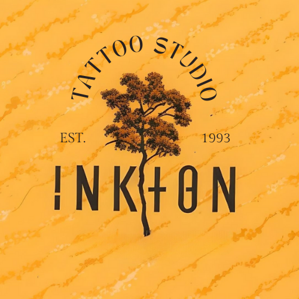
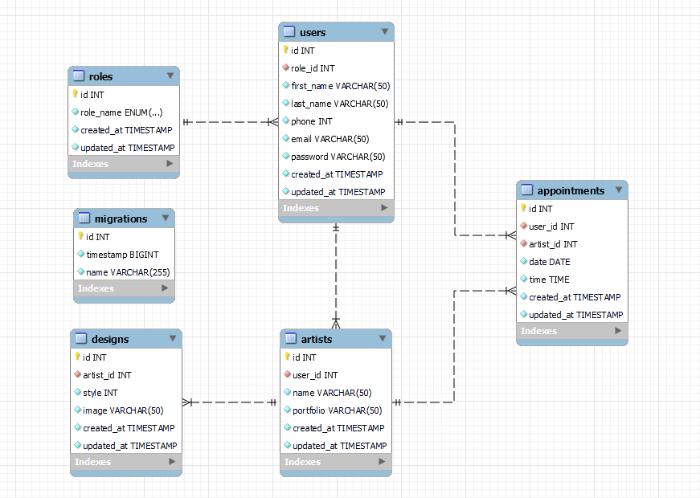

# <h1 align="center"> 🔥 Backend App - Tattoo Studio 🔥</h1>

<div style="text-align: center;"></div>

<details>
  <summary> Contenido 📝</summary>
  <ol>
    <li><a href="#objetivo">Objetivo</a></li>
    <li><a href="#sobre-el-proyecto">Sobre el proyecto</a></li>
    <li><a href="#tecnologías-">Tecnologías</a></li>
    <li><a href="#diagrama-bd">Diagrama</a></li>
    <li><a href="#instalación-en-local">Instalación</a></li>
    <li><a href="#endpoints-">Endpoints</a></li>
    <li><a href="#futuras-funcionalidades">Futuras funcionalidades</a></li>
    <li><a href="#contribuciones">Contribuciones</a></li>
    <li><a href="#licencia">Licencia</a></li>
    <li><a href="#webgrafia">Webgrafia</a></li>
    <li><a href="#agradecimientos">Agradecimientos</a></li>
    <li><a href="#contacto">Contacto</a></li>
  </ol>
</details>

## Objetivo
Este proyecto requería una API funcional conectada a una base de datos con algunas de las relaciones ya conocidas, ademas de un minimo de endpoints requeridos entorno a los usuarios y citas de los mismos. 

## Sobre el proyecto
Se solicita la creacion del backend de una aplicación web para ayudar a este estudio de tatuajes que recien comienza en el mercado, facilitando el registro de usuarios y que les permitiría la gestión de citas de sus potenciales clientes con artistas de renombre en el mundo del tattoo. 

## Tecnologías 🚀
<div align="center">


 </div>


## Diagrama BD
En el siguiente diagrama se refleja las relaciones que tendrán cada una de las tablas creadas, dando la posibilidad de asignar roles de user a los clientes, admin para tatuadores y super_admin para el encargado, con diferencia de privilegios en la base de datos para cada uno. 
<div style="text-align: center;">
 
</div>

## Instalación en local
1. Clonar el repositorio
2. ` $ npm install `
3. Conectamos nuestro repositorio con la base de datos 
4. ``` $ Ejecutamos las migraciones ``` 
5. ``` $ npm run dev ``` 

## Endpoints 📍
<details>
<summary>Endpoints</summary>

- AUTH
    - REGISTER

            POST http://localhost:3000/api/register

        body:
        ``` js
            {
                "user": "David",
                "email": "david@david.com",
                "password": "princes"
            }
        ```

    - LOGIN

            POST http://localhost:3000/api/login  

        body:
        ``` js
            {
                "email": "david@david.com",
                "password": "princes"
            }
        ```

    - PROFILE

          GET http://localhost:3000/api/:id

    - Insertamos el ID del user para que nos muestre todos los datos

  - UPDATE

          PATCH http://localhost:3000/api/:id

    body:

    ```js
        {
            "name": "NewUserNew  ",
            "password": "NewPrinces1234@",
            "phone_number": "55555559"
        }
    ```

  - GET ALL ARTISTS

          GET http://localhost:3000/api/artists/list

</details>
<details>
<summary>APPOINTMENTS ENDPOINTS</summary>

- APPOINMENTS
    - CREATE 

              POST http://localhost:3000/api/appointments/newAppointment

    body:

    ```js
        {
            "user_id": "1",
            "date": "2024/03/28",
            "time": "14:00"
        }

    ```

    - UPDATE

          PATCH http://localhost:3000/api/appointments/:id

    body:

    ```js
        {
            "user_id": "1",
            "date": "2024-03-29",
            "time": "14:00"
        }
    ```

    - DELETE

          DELETE http://localhost:3000/api/appointments/:id

    body:

    ```js
        {
           "id": "6"
        }
    ```

    - GET ALL APPOINTMENTS BY CUSTOMER

          GET http://localhost:3000/api/appointments/mysessions/:id

    - GET ALL APPOINTMENTS BY ARTIST

          GET http://localhost:3000/api/appointments/myappointments/:id

</details>

## Futuras funcionalidades
[ ] Permitir que el tatuador actualice las citas.
[ ] Permita que el tatuador cree citas para los clientes. 
[ ] Permitir múltiples productos en una sola cita.

## Contribuciones
Las sugerencias y aportaciones son siempre bienvenidas.  

Puedes hacerlo de dos maneras:

1. Abriendo una issue
2. Crea un fork del repositorio
    - Crea una nueva rama  
        ```
        $ git checkout -b feature/nombreUsuario-mejora
        ```
    - Haz un commit con tus cambios 
        ```
        $ git commit -m 'feat: mejora X cosa'
        ```
    - Haz push a la rama 
        ```
        $ git push origin feature/nombreUsuario-mejora
        ```
    - Abre una solicitud de Pull Request

## Licencia
Este proyecto está bajo la Licencia MIT. Consulte el archivo de LICENCIA para obtener más información.

## Webgrafia:
Para conseguir mi objetivo he recopilado información de:
- https://github.com/fidelfsd/fsd-online-express-typeorm-academy-api
- https://typeorm.io/
- https://orkhan.gitbook.io/typeorm/docs/migrations

## Agradecimientos:

Este proyecto ha sido posible gracias al arduo trabajo de los profesores Fidel Gilart y Javier Rodríguez, quienes comparten sus conocimientos con estusiasmo y mucha dedicación, ademas a mis compañeros, por el apoyo incondicional y muy paciente.:

- **Gabriel Escudillo**  
<a href="https://github.com/GabrielEscudillo" target="_blank"></a> 

- **Erika Orlando** <a href="https://github.com/AkireOrl"> 

</a>

- **Fidel Gilart**  
<a href="https://github.com/fidelfsd" target="_blank"></a>

- **Javier Rodriguez**  
<a href="https://github.com/JavierRodriguez78" target="_blank"></a> 

## Autor

- **Pedro Rondón León**

## Contacto   
<a href = "mailto:pedro.rondonx@gmail.com"  target="_blank">

</a>
<a href="https://github.com/pedrowolfr"  target="_blank">
    
</a>  
<a href="https://www.linkedin.com/in/pedro-rond%C3%B3n-leon-1224ba168/" target="_blank">

</a> 

[](#) 
